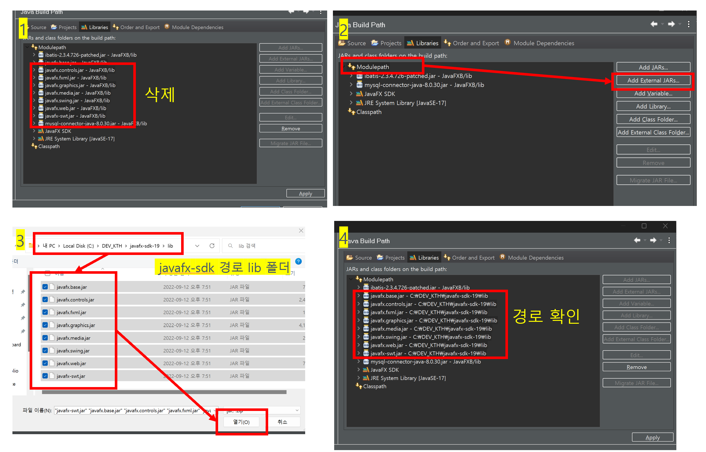

### Java FX

- 이클립스 javafx 플러그인 설치   
```
[help] -> Eclipse Marketplace -> javafx 검색 -> e(fx)clipse 설치  -> 재시작   
```
- JavaFX 프로젝트 생성   
```
[File] -> [New] -> [Other] -> JavaFX -> JavaFX Project   
```

- JavaFX SDK 다운로드   
https://gluonhq.com/products/javafx/

다운로드 후 압축풀기   

- JavaFX 라이브러리 추가   
```
프로젝트 우클릭 -> Build Path -> Configure Build Path..
-> Libraries 탭 -> Add External JARs... -> SDK\lib 폴더 jar 파일 추가
-> Run Main
```

- Fxml 편집 SceneBuilder 다운로드 및 설치   
https://gluonhq.com/products/scene-builder/

- SceneBuilder 이클립스 연동  
```
[Windows] -> [Prefrences] -> [JavaFX] -> [SceneBuilder executable] -> 경로저장
```


**!오류내용**
``` 
기본 클래스 application.Main을(를) 찾거나 로드할 수 없습니다.
java.lang.NoClassDefFoundError: javafx/application/Application
```
	
**원인:** 모듈 path 와 모듈 패키지 등록 필요

**해결방법:** 
	[Run configuration ...] 클릭 -> [Arguments] 탭에서 -> [VM Arguments] 작성   
```
	--module-path "JavaFX SDK 경로\lib" --add-modules=javafx.controls,javafx.fxml
```

- fx_board 테이블 
```
CREATE TABLE `fx_board` (
  `BOARD_ID` int(11) NOT NULL AUTO_INCREMENT,
  `BOARD_TITLE` varchar(255) DEFAULT NULL,
  `BOARD_WRITER` varchar(255) DEFAULT NULL,
  `BOARD_CONTENT` longtext,
  `BOARD_DATE` timestamp NULL DEFAULT CURRENT_TIMESTAMP,
  PRIMARY KEY (`BOARD_ID`)
) ENGINE=InnoDB AUTO_INCREMENT=8 DEFAULT CHARSET=utf8;

```


**!오류내용** 
```
Graphics Device initialization failed for :  d3d, sw   
	Error initializing QuantumRenderer: no suitable pipeline found   
```

**원인:** JavaFX 관련 jar 파일만 등록하여 생긴 문제.   
	JavaFX SDK bin 폴더에  dll파일들도 같이 참조해야하기에 상대경로 찾을수 없어 발생한 문제.   
	
**해결방법:** JavaFX SDK로 다시 추가      

